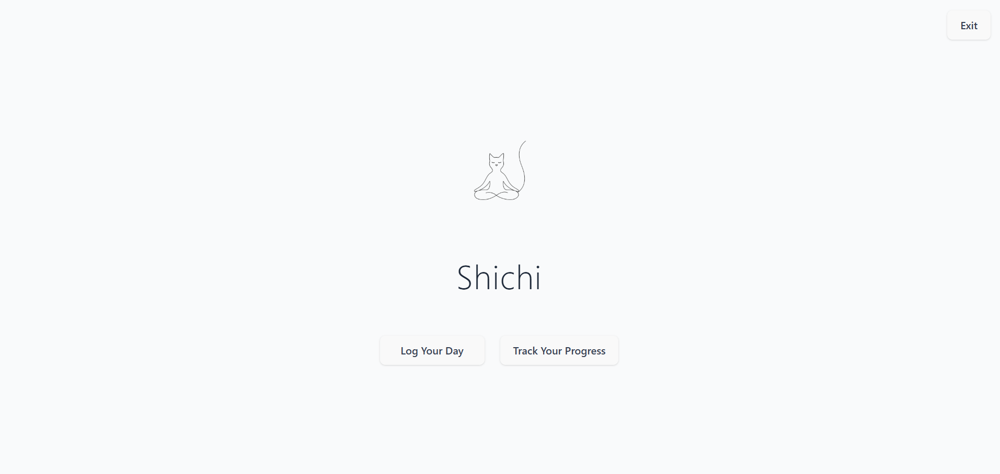
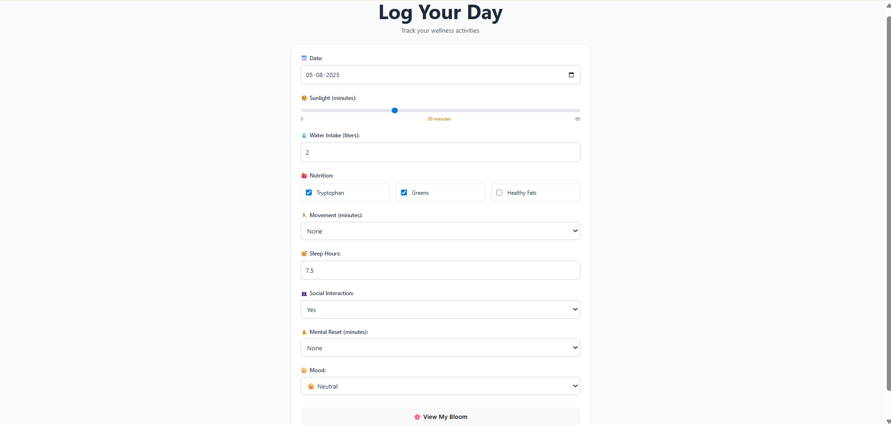
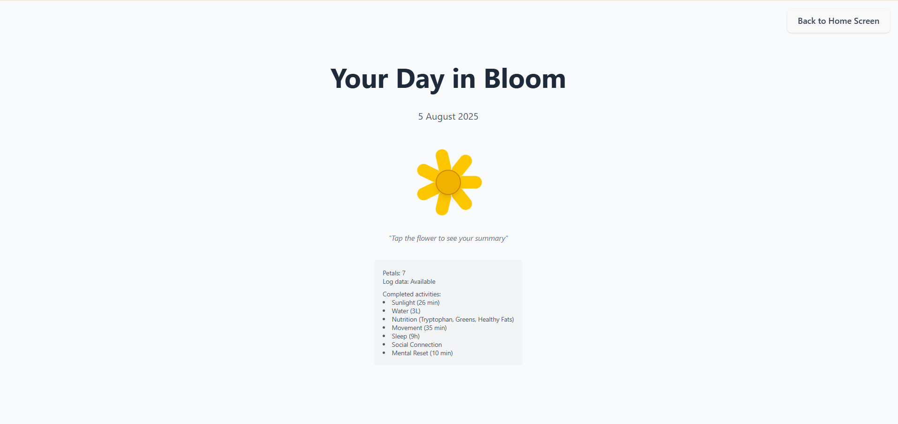
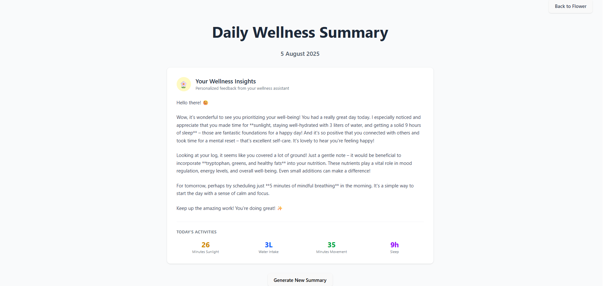
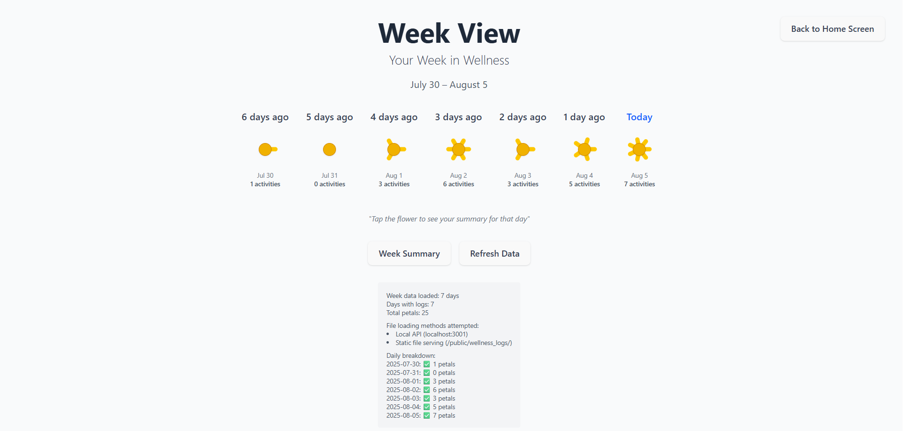
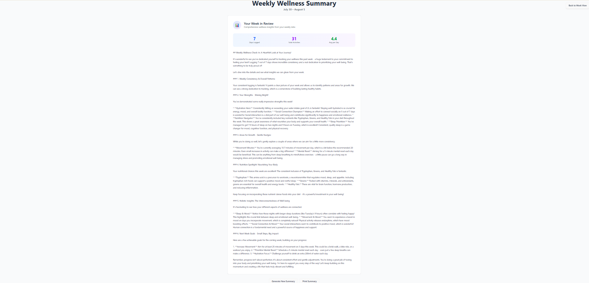

# 🌸 Shichi – A Mindful, Local-First Wellness Tracker

**Shichi** is a beautifully minimalist self-care tracker that visualizes your wellness as a 7-petal flower. Each petal represents a vital area of your well-being — and blooms when you meet your daily goals.

Built with privacy in mind, **Shichi runs fully offline** and leverages on-device AI (powered by **Gemma 3n**) to generate reflective daily and weekly wellness summaries — without storing your data in the cloud.

> “Wellness is not performance. It's presence.” — Shichi 🌿

---

## ✨ Features

- 🌼 **Flower Visualization** – Watch your self-care bloom daily across 7 wellness pillars.
- 📝 **Log Your Day** – Track sunlight, water, movement, sleep, nutrition, mood, and more.
- 🤖 **AI-Powered Insights** – Receive reflective summaries powered by **Gemma 3n**.
- 📈 **Weekly Review** – Get holistic feedback and personalized goals every 7 days.
- 🖨️ **Printable Summaries** – Export your weekly wellness report as a shareable file.
- 🔐 **100% Local-First** – No accounts, no sync — your data stays on your device.
- 🔄 **Retention Policy** – Automatically cleans up logs daily at 2:00 AM, keeping only the **latest 7 days** for a lightweight, distraction-free experience.

---

## 📺 Live Demo

🎥 [Watch the Shichi Demo on YouTube](https://youtu.be/AVnyiI5V_g0?si=8V1WkoBTXV8aR4Ek)

---

## 🧠 Powered by Gemma 3n

Shichi integrates **Gemma 3n**, a lightweight local LLM, to generate personalized summaries that act like a mindful wellness coach.  
Each summary includes:
- ✅ Weekly consistency check
- 🌱 Strengths you showed
- 🪴 Areas for growth
- 🧬 Nutrition analysis (tryptophan, greens, healthy fats)
- 🧘 Holistic insights (mood, sleep, habits)
- 🎯 Next week’s personalized goals

---

## 🖼️ App Screenshots

| Home Screen | Log Screen | Flower Screen | Day Summary Screen | Weekly Progress Screen | Week Summary Screen |
|-------------|---------------|----------------|-------------|---------------|----------------|
|  |  |  |  |  |  |

---

## 🚀 Local Setup

```bash
git clone https://github.com/HarshavardhanaNaganagoudar/shichi.git
cd shichi
